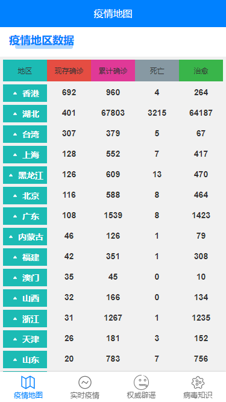
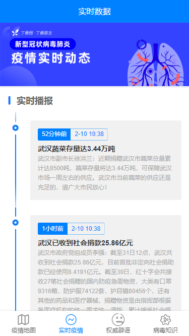

<!--
 * @Author: xuanyu
 * @LastEditors: xuanyu
 * @email: 969718197@qq.com
 * @github: https://github.com/z-xuanyu
 * @Date: 2022-04-20 14:14:55
 * @LastEditTime: 2022-04-20 17:54:44
 * @Description: Modify here please
-->
# uniapp-nCoV
uniapp开发疫情信息小程序（项目是学习demo）

### 运行项目

1、下载 HBuilder X 开发者工具 <a href='https://www.dcloud.io/hbuilderx.html'>下载地址</a>

2、克隆项目
```bash
 $ git clone https://github.com/z-xuanyu/uniapp-nCoV.git
```

3、克隆项目api站（使用说明在该仓库Readme有写）
```bash
 $ git clone https://github.com/z-xuanyu/nCov-api.git
```
4、在HBuilder X 工具中导入项目运行即可

### 演示图

 




